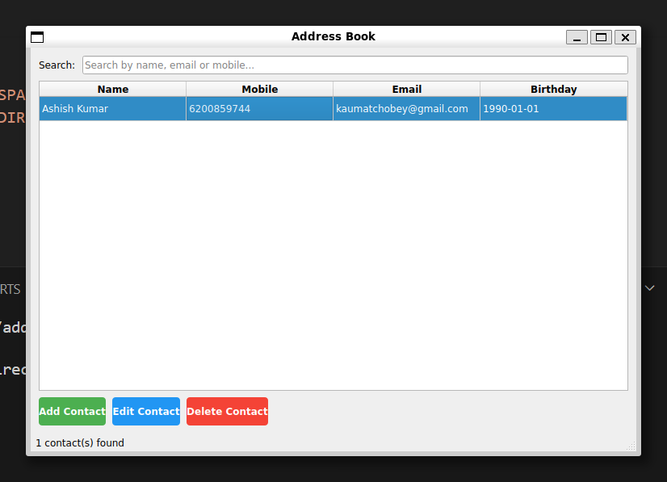

# Address Book — Qt/C++ Application

A simple yet fully featured desktop Address Book application built with **Qt 5** and **C++17**, using **SQLite** for persistent contact storage.

---

## Features

- View all contacts in a sortable table
- Add new contacts with validation
- Edit existing contacts
- Delete contacts with confirmation
- Search contacts by name, mobile, or email
- Field validation (email format, mobile digits, birthday format)
- Persistent SQLite database storage
- Clean and modern UI with color-coded buttons

---

## Screenshot



## Requirements

- Debian / Ubuntu Linux
- Qt 5.15 or higher
- GCC with C++17 support
- SQLite (included with Qt)

### Install Dependencies
```bash
sudo apt-get update
sudo apt-get install -y \
  build-essential \
  qtbase5-dev \
  qtbase5-dev-tools \
  qt5-qmake \
  libqt5sql5-sqlite \
  libqt5test5t64
```

---

## Build and Run
```bash
git clone https://github.com/Ashish-kumarsn/address-book-qt.git
cd address-book-qt
qmake
make
./build/addressbook
```

---

## Run Unit Tests
```bash
cd tests
qmake
make
./build/tst_addressbook
```


## Contact Fields

| Field    | Validation                          |
|----------|-------------------------------------|
| Name     | Cannot be empty                     |
| Mobile   | 7-15 digits, optional + prefix      |
| Email    | Must match standard email format    |
| Birthday | Must be in YYYY-MM-DD format        |

---

## Database

Contacts are stored in a SQLite database at:
```
~/.local/share/AddressBookApp/AddressBook/addressbook.db
```

---

## License

MIT License


